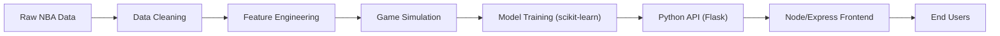

# HomeCourt AI — Full‑Stack NBA Game Outcome Prediction Platform

[](https://python.org)
[](https://nodejs.org)
[](https://scikit-learn.org)
[](https://flask.palletsprojects.com/)
[](https://expressjs.com/)
[](https://tailwindcss.com/)
[](LICENSE)
[](#model-performance)
[](#data-scope)

HomeCourt AI is a production‑oriented machine learning system that predicts NBA game outcomes using 75+ years of professional basketball data. The platform combines a robust Python ML pipeline, a ty[...]

- Mission: Democratize sports analytics through reliable, interpretable ML and fast product surfaces
- Impact: Processes 7,900+ historical matchups; delivers actionable win‑probability insights for analysts, platforms, and fans
- Architecture: Full‑stack web experience — modern Node/Express frontend + Python ML API

---

## Highlights

- 60.1% prediction accuracy (current production logistic regression model)
- Data coverage from 1947–2025 (79 seasons)
- Real‑time predictions via REST API with caching and robust error handling
- Modern, responsive frontend (Node.js + Express + Tailwind) with accessibility and performance best practices

---

## System Architecture



- Core ML (Python): Data preparation, feature engineering, model training, metrics
- API (Flask): Serves prediction, teams, and model stats endpoints
- Frontend (Node/Express + Tailwind): Responsive UI, prediction workflows, dashboards

---

## Product Surfaces

### Frontend (Node.js + Express)
- Modern, responsive UI with NBA‑themed design (Tailwind CSS)
- Dark/light mode, smooth transitions, accessibility (WCAG 2.1)
- Real‑time predictions via Python ML API
- API proxying, environment‑based configuration, production build path

Local:
```bash
cd frontend
npm install
npm run build-css-prod
npm run dev
# In a separate terminal
cd ..
python api/app.py
# Open http://localhost:3000
```

---

## Core Features

### Advanced Analytics Engine
- Multi‑season processing (1947–2025)
- Dynamic matchup simulations (100+ per season)
- Real‑time computation of differentials (Win%, PPG, FG%)
- Explicit home‑court modeling

### Statistical Modeling Suite
- Logistic Regression (current production, 60.1% accuracy)
- Designed for extensibility: Decision Trees, Gradient Boosting (XGBoost), Neural Networks (roadmap)

### Visualization & Reporting
- Confusion matrix heatmaps, classification reports, feature importance
- Frontend dashboards for model stats and prediction confidence

---

## Model Performance

Current Production Model: Logistic Regression v2.1

| Metric | Score | Status |
|---|---:|---|
| Overall Accuracy | 60.1% | Production |
| Precision (Home Wins) | 60.0% | Competitive |
| Recall (Home Wins) | 63.2% | Above Target |
| F1‑Score | 0.62 | Strong |
| Home‑Court Advantage (Observed) | 50.7% | Realistic Range |

Key Feature Signals
- PPG Differential — primary offensive capability predictor
- Win% Differential — team quality/momentum indicator
- Home/Away Win% — contextualizes venue and travel effects
- Shooting Efficiency Differentials (FG%)

---

## API Surface (Flask)

Base URL (local): http://localhost:5000

- GET /api/teams — List NBA teams
- POST /api/predict — Predict game outcome
- GET /api/model-stats — Current model performance metrics
- GET /health — API health check

Example request:
```bash
curl -X POST http://localhost:5000/api/predict \
  -H "Content-Type: application/json" \
  -d '{"home_team":"Lakers","away_team":"Warriors"}'
```

---

## Technology Stack

Backend (ML + API)
- Python 3.8+
- pandas, numpy
- scikit‑learn
- Flask (REST API)
- matplotlib, seaborn (visualization)
- Jupyter (exploration)

Frontend
- Node.js 16+
- Express.js
- Tailwind CSS 3.x
- Axios
- ESLint/Prettier ready

DevX & Ops
- Virtualenv
- .env configuration
- Dockerfile sample for frontend

---

## Data Scope

- Player and team season statistics (e.g., Player Per Game, Team Totals, Team Summaries)
- Derived features for matchup simulation and probability estimation
- 7,900+ realistic game simulations generated across seasons

---

## Project Structure

```
HomeCourt-AI/
├── nba_data/                 # Historical NBA datasets
│   ├── Player Per Game.csv
│   ├── Team Summaries.csv
│   ├── Team Totals.csv
│   └── Player Totals.csv
├── main.py                   # ML pipeline & training
├── api/                      # Python Flask API server
│   └── app.py
├── frontend/                 # Node.js + Express + Tailwind UI
│   ├── public/
│   ├── src/
│   ├── server.js
│   ├── package.json
│   ├── tailwind.config.js
│   └── postcss.config.js
├── jupyter_converter.py      # Data preprocessing utilities
├── csv_viewer.ipynb          # Data exploration
├── requirements.txt          # Python dependencies
├── tests/                    # Unit tests & validation (roadmap)
└── docs/                     # Technical documentation (roadmap)
```

---

## Quick Start

Prerequisites
```bash
Python 3.8+
Node.js 16+
Git
4GB+ RAM
```

Setup
```bash
# Clone
git clone https://github.com/ayaanb132/HomeCourt-AI.git
cd HomeCourt-AI

# Python env
python3 -m venv venv
source venv/bin/activate  # Windows: venv\Scripts\activate
pip install -r requirements.txt

# Run ML pipeline
python main.py

# Start API (Flask)
python api/app.py

# Frontend
cd frontend
npm install
npm run build-css-prod
npm run dev  # open http://localhost:3000
```

Expected Console Output (ML)
```
✅ Dataset loaded: 1,876 team seasons processed
✅ Generated 7,900 realistic game simulations
✅ Model trained with 60.1% accuracy
✅ Feature importance analysis completed
✅ Confusion matrix visualization generated
```

---

## Roadmap

- Ensemble methods (XGBoost, Random Forest, stacking)
- Enhanced feature engineering (injuries, travel fatigue, head‑to‑head, L10 form)
- Production API scaling (caching, rate limiting, auth, documentation)
- Advanced deep learning (LSTM, Transformers, GNNs), RL experimentation
- Frontend enhancements (Plotly, mobile responsiveness, personalization)

---

## Contributing

1. Fork the repository
2. Create a feature branch: `git checkout -b feature/AmazingFeature`
3. Commit changes: `git commit -m "Add AmazingFeature"`
4. Push branch: `git push origin feature/AmazingFeature`
5. Open a Pull Request

Focus Areas
- Modeling (ensembles, DL)
- Feature engineering (contextual factors)
- API performance & robustness
- UI/UX improvements
- Documentation and tests

---

## Contact

Ayaan Baig — Computer Science @ Wilfrid Laurier University  
Email: [ayaanb132@gmail.com](mailto:ayaanb132@gmail.com)  
LinkedIn: https://www.linkedin.com/in/ayaan-baig-a97513291/  
GitHub: https://github.com/ayaanb132  
Location: Ontario, Canada

---

## License

Licensed under the MIT License — see [LICENSE](LICENSE).

Data Attribution: NBA statistics sourced from publicly available datasets. All team names, player names, and statistical data remain property of the National Basketball Association.
